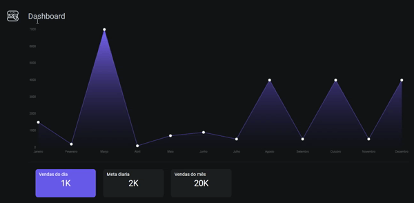
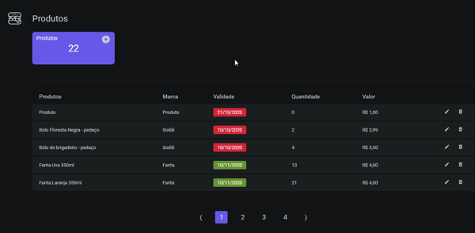
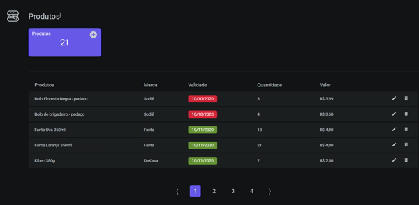
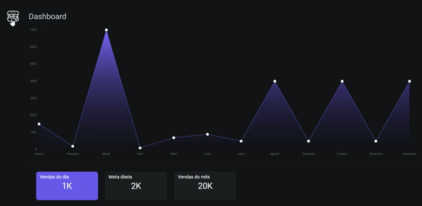
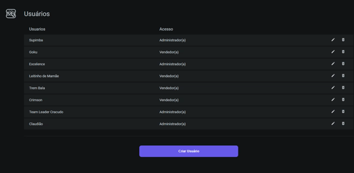
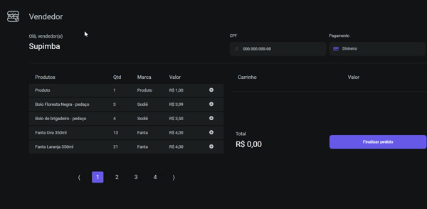

<h1 align="center">
    
</h1>

<p align="center">
  <a href="#page_with_curl-sobre">Sobre</a>&nbsp;&nbsp;&nbsp;|&nbsp;&nbsp;&nbsp;
  <a href="#books-tecnologias">Tecnologias</a>&nbsp;&nbsp;&nbsp;|&nbsp;&nbsp;&nbsp;
  <a href="#rocket-começando">Começando</a>
</p>

<h1 align="center">
    
    
    
    
    
    
    
    
</h1>

## :page_with_curl: Sobre
Sistema para cantinas escolares, com o objetivo de suprir as necessidades do cliente para realização e automatização dos processos de seu comércio.

## :books: Tecnologias
-  [ReactJS](https://reactjs.org/)
-  [React Router v4](https://github.com/ReactTraining/react-router)
-  [styled-components](https://www.styled-components.com/)
-  [Axios](https://github.com/axios/axios)
-  [History](https://www.npmjs.com/package/history)
-  [Polished](https://polished.js.org/)
-  [React-Toastify](https://fkhadra.github.io/react-toastify/)
-  [React-Icons](http://react-icons.github.io/react-icons/)
-  [Unform](https://github.com/Rocketseat/unform)
-  [Yup](https://www.npmjs.com/package/yup)
-  [date-fns](https://date-fns.org/)
-  [react-burger-menu](https://github.com/negomi/react-burger-menu)
-  [react-confirm-alert](https://www.npmjs.com/package/react-confirm-alert)
-  [react-js-pagination](https://www.npmjs.com/package/react-js-pagination)
-  [VS Code][vc] with [EditorConfig][vceditconfig] and [ESLint][vceslint]


## :rocket: Começando
Para clonar a aplicação você precisa do [Git](https://git-scm.com), [Node.js v10.16][nodejs] ou superior + [Yarn v1.13][yarn] ou superior.

```bash
# Clonar o repositório
$ git clone https://github.com/Cantina-Ninja/cantina-front

# Entrar na pasta 
$ cd cantina-front 

# Instalar as dependencias
$ yarn install

# Iniciar a aplicação
$ yarn start
```
